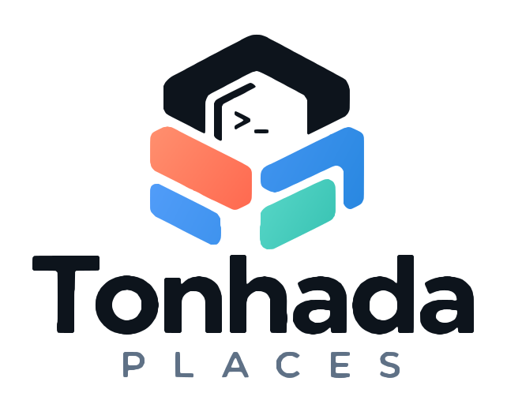

  <picture>
    <source media="(prefers-color-scheme: dark)" srcset="assets/logo-tonhada-places-fundo-escuro.svg">
    <source media="(prefers-color-scheme: light)" srcset="assets/logo-tonhada-places-fundo-claro.svg">
    
  </picture>

  <strong>From code to the real world.</strong> 
  Apps, AI agents, and 3D printing — with room for new ideas.

---

**Tonhada Places** is home to our software and creative projects. We build tools to work better, explore possibilities, and turn ideas into real things.

## Our projects

### Comota

**How's your Mac doing?** An app for monitoring CPU, memory, and network usage, alongside AI agent usage limits.

*In development.*

### Tonton ADE! Terminal for workspaces and agents

A terminal app built around **workspaces, Git worktrees, and AI agents**. A place to organize development environments and bring agents into your workflow.

*In development. Name to be announced.*

## What guides us

Clarity, efficient use of resources, and the freedom to experiment. We value useful tools, straightforward interfaces, and technology that helps people create instead of getting in the way.

## A name with family roots

Tonhada Places began with a nickname for our **Tonton**. The name grew alongside our ideas, and today it brings together apps, 3D printing, and projects still to come.

---

  A family-inspired name. Endless possibilities.

